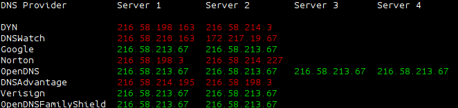

# Unearth

A simple tool to show the progress of a DNS record propagation across multiple name servers

## Usage

```bash
./unearth.sh [ARGS]
```

### Arguments

```bash
--fqdn --FQDN
	Fully Qualified Domain Name

--target -t
	The target value for the DNS record

--record -R
	The type of DNS record to check (A, AAAA, CNAME, etc) (default: 'A')

-h --help
	This help message
```

## Screen Shot

